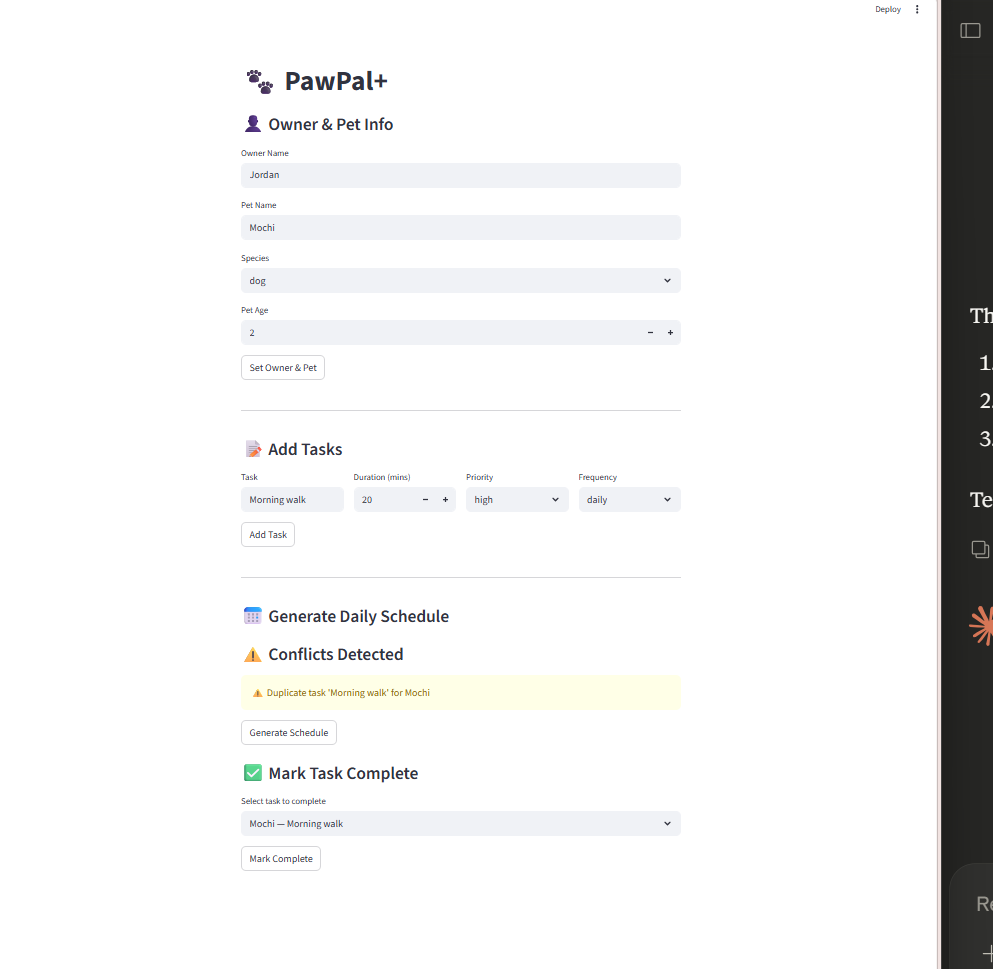

# 🐾 PawPal+

A smart pet care scheduling app built with Python and Streamlit.

## 📋 Overview

PawPal+ helps pet owners organize and manage daily care tasks for 
their pets. It features intelligent scheduling with priority-based 
sorting, conflict detection, and recurring task management.

## ✨ Features

- **Add owner and pet info** — Register a pet with name, species, and age
- **Schedule tasks** — Add care tasks with duration, priority, and frequency
- **Priority-based scheduling** — Tasks sorted by High, Medium, Low priority
- **Conflict warnings** — Flags duplicate tasks for the same pet
- **Recurring tasks** — Daily/weekly tasks auto-schedule on completion
- **Mark tasks complete** — Track progress through the day

## 🗂 Project Structure
```
pawpal_system.py   # Core logic: Task, Pet, Owner, Scheduler
app.py             # Streamlit UI
main.py            # CLI demo script
tests/
  test_pawpal.py   # Automated test suite
reflection.md      # Design decisions and AI strategy
```

## 🚀 Getting Started
```bash
py -m pip install streamlit pytest
py -m streamlit run app.py
```

## 🧪 Testing PawPal+
```bash
py -m pytest
```

**Tests cover:**
- Task completion status change
- Recurring task generation
- Non-recurrence for once tasks
- Priority sorting correctness
- Schedule filtering by status
- Empty schedule edge case

**Confidence Level: ⭐⭐⭐⭐ (4/5)**

## 📸 Demo

> 


## Smarter Scheduling

PawPal+ includes algorithmic enhancements:
- **Priority sorting** — Scheduler.generate_schedule() orders tasks 
  by high, medium, low priority
- **Conflict detection** — Flags duplicate tasks for the same pet
- **Recurring tasks** — Uses Python to auto-schedule next occurrence
# PawPal+ (Module 2 Project)

You are building **PawPal+**, a Streamlit app that helps a pet owner plan care tasks for their pet.

## Scenario

A busy pet owner needs help staying consistent with pet care. They want an assistant that can:

- Track pet care tasks (walks, feeding, meds, enrichment, grooming, etc.)
- Consider constraints (time available, priority, owner preferences)
- Produce a daily plan and explain why it chose that plan

Your job is to design the system first (UML), then implement the logic in Python, then connect it to the Streamlit UI.

## What you will build

Your final app should:

- Let a user enter basic owner + pet info
- Let a user add/edit tasks (duration + priority at minimum)
- Generate a daily schedule/plan based on constraints and priorities
- Display the plan clearly (and ideally explain the reasoning)
- Include tests for the most important scheduling behaviors

## Getting started

### Setup

```bash
python -m venv .venv
source .venv/bin/activate  # Windows: .venv\Scripts\activate
pip install -r requirements.txt
```

### Suggested workflow

1. Read the scenario carefully and identify requirements and edge cases.
2. Draft a UML diagram (classes, attributes, methods, relationships).
3. Convert UML into Python class stubs (no logic yet).
4. Implement scheduling logic in small increments.
5. Add tests to verify key behaviors.
6. Connect your logic to the Streamlit UI in `app.py`.
7. Refine UML so it matches what you actually built.


